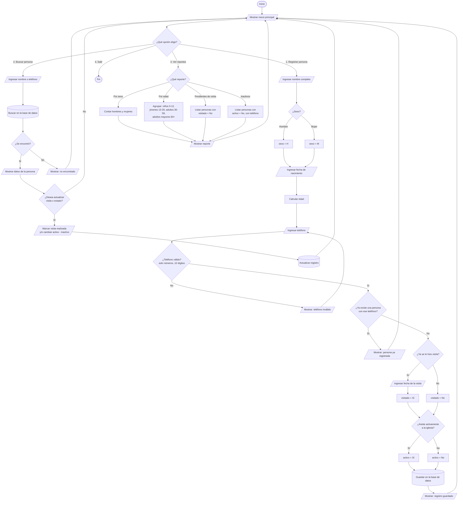

# Diagrama de flujo – App de registro de miembros de la iglesia

La app guarda estos datos de cada persona: nombre, sexo (hombre o mujer),
edad, teléfono, si ya se le hizo visita y si está activa en la iglesia.

GitHub dibuja el diagrama automáticamente (también está como imagen en
[`diagrama-flujo.png`](diagrama-flujo.png)). También puedes copiar el bloque
`mermaid` en <https://mermaid.live> para verlo, editarlo o exportarlo como imagen.

## Qué hace cada parte

| Símbolo | Significado |
|---|---|
| Óvalo `([ ])` | Inicio o fin |
| Rectángulo `[ ]` | Proceso (el sistema hace algo) |
| Paralelogramo `[/ /]` | Entrada o salida (el usuario escribe o el sistema muestra) |
| Rombo `{ }` | Decisión (Sí / No u opciones) |
| Cilindro `[( )]` | Base de datos |

1. **Registrar persona**: se piden el nombre, el sexo, la fecha de nacimiento
   (la edad se calcula sola), el teléfono (se valida y se revisa que no
   exista ya), si ya se le visitó y si está activa. Luego se guarda.
2. **Buscar persona**: se busca por nombre o teléfono y se puede marcar la
   visita como realizada o cambiar el estado de activo o inactivo.
3. **Reportes**: cuántos hombres y mujeres hay, cuántas personas hay por rango
   de edad, quiénes faltan por visitar y quiénes están inactivos (con su
   teléfono, para llamarlos).
4. **Salir**.
